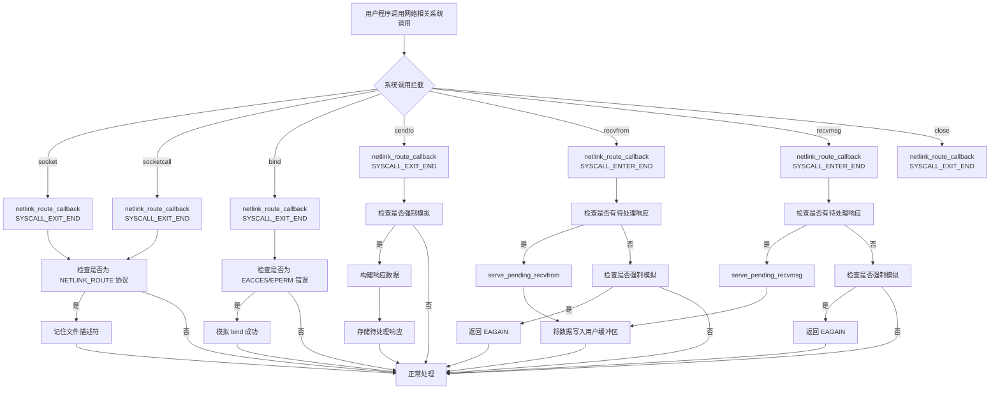
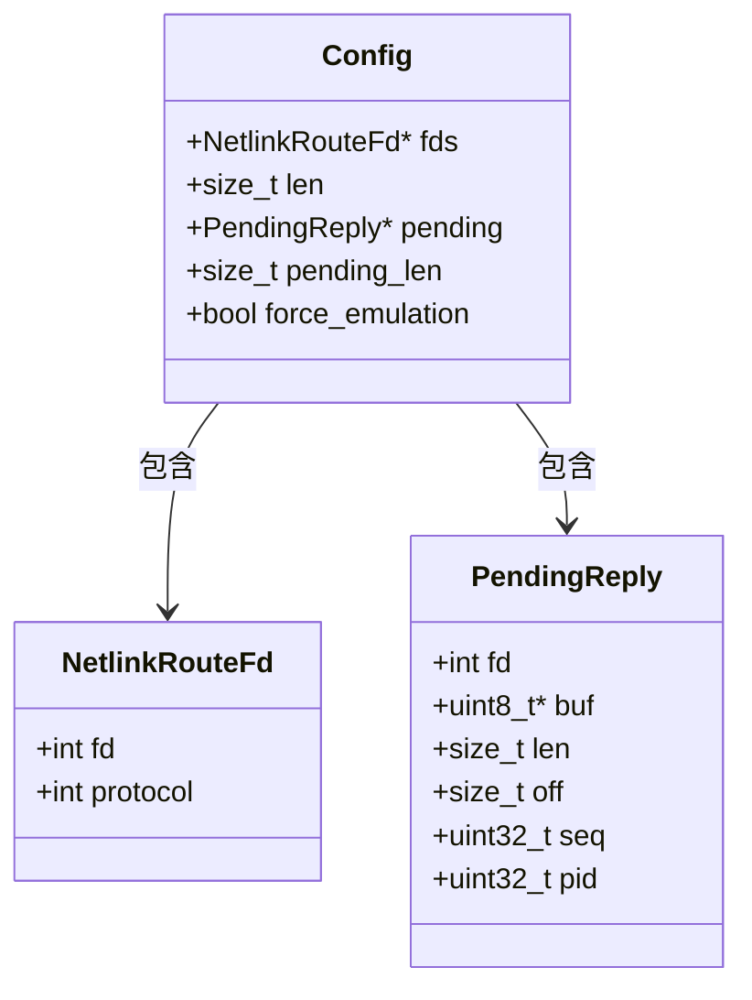
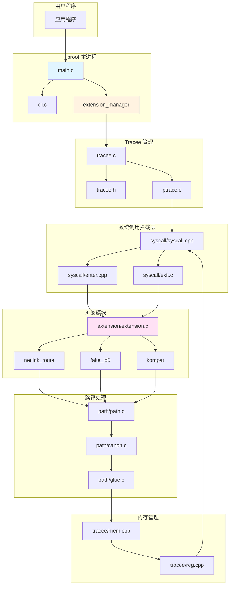
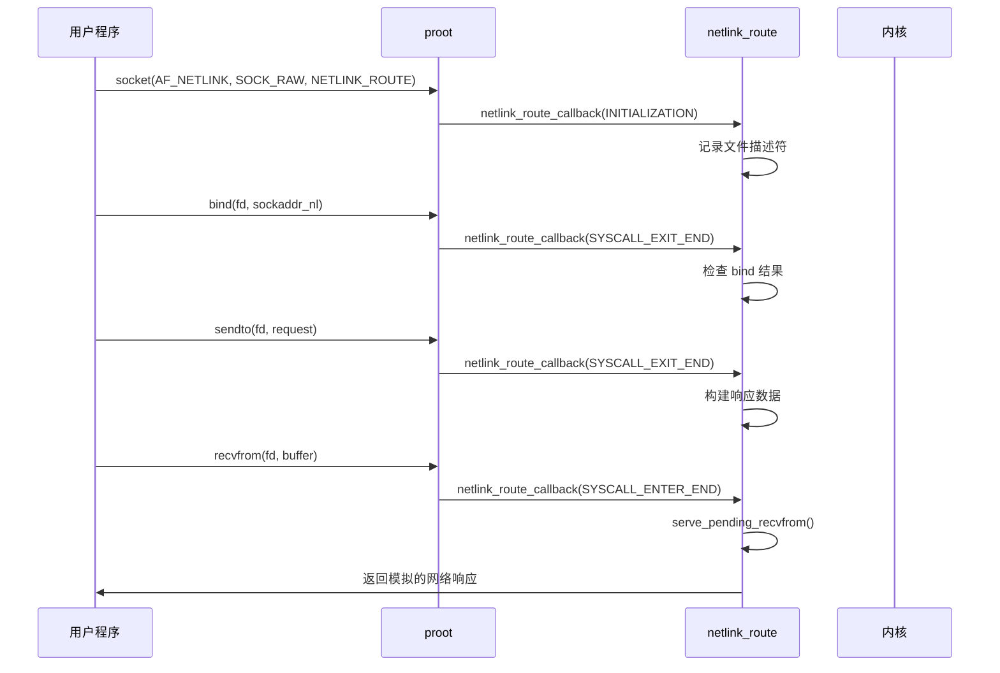
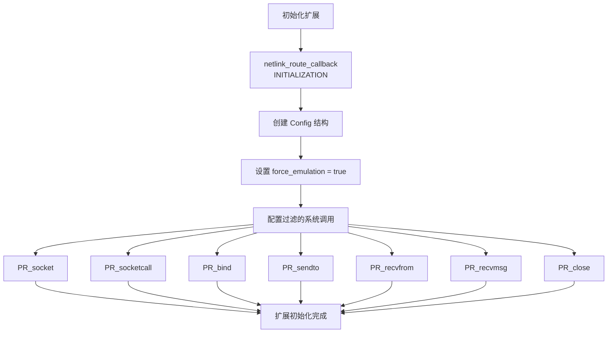
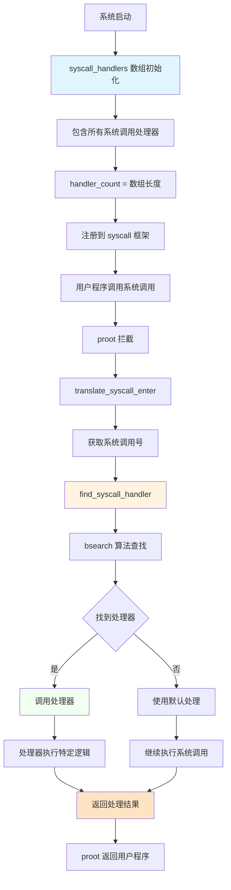
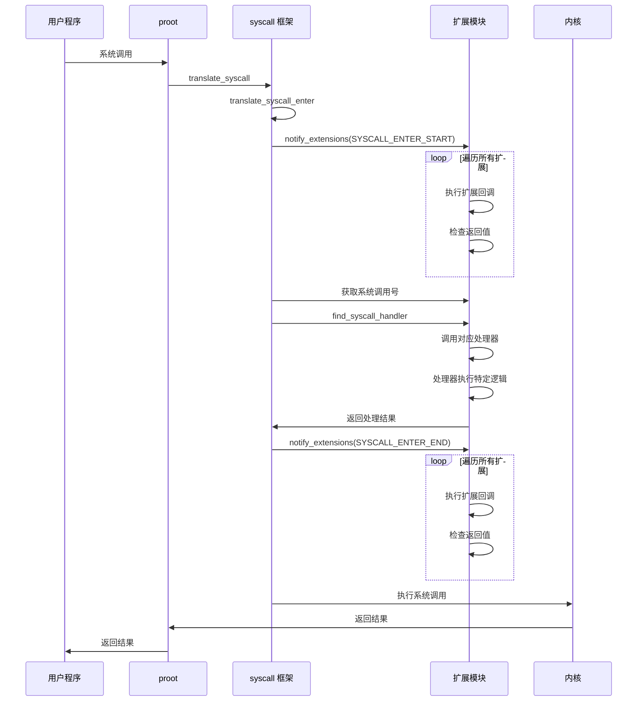
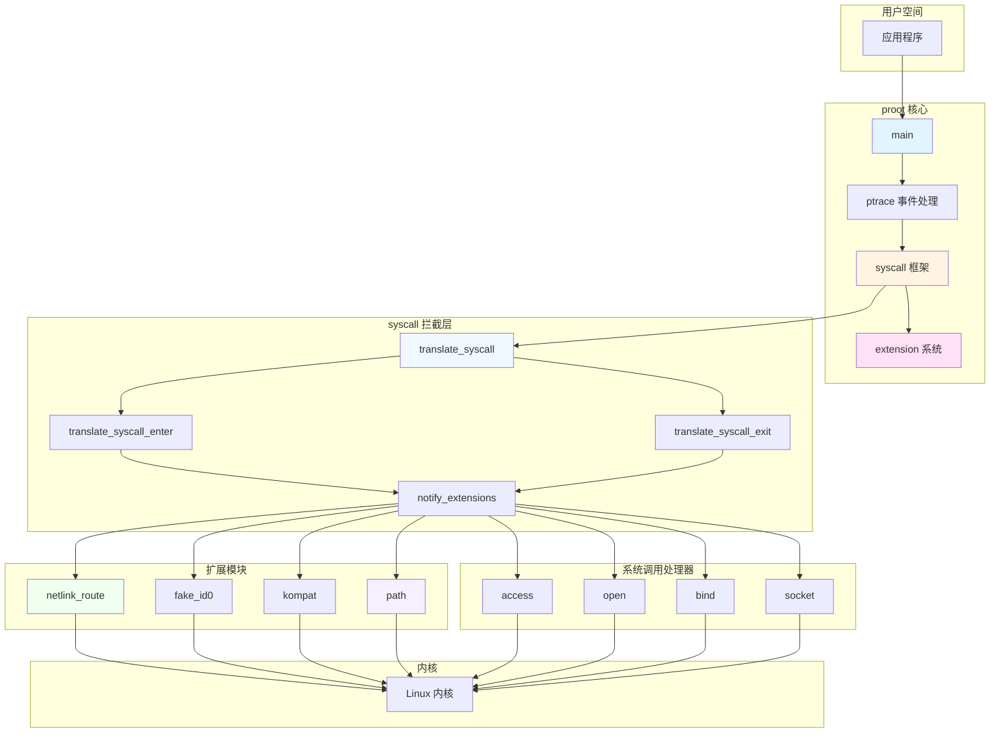
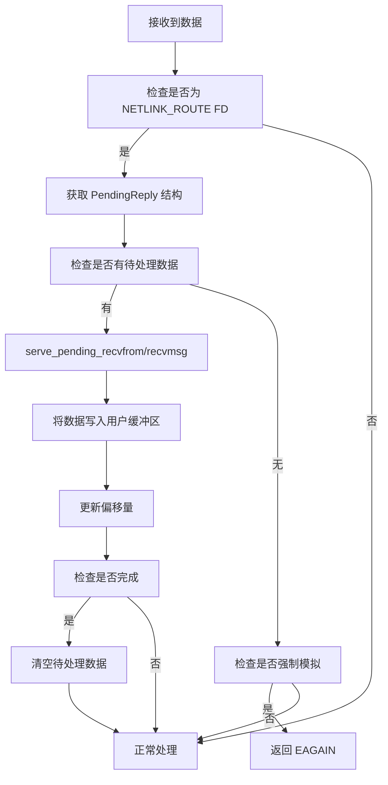

# proot-scicat netlink_route 实现图与整体执行结构

## 1. netlink_route 执行流程图



## 2. netlink_route 数据结构图



## 3. 整体 proot 执行结构图



## 4. netlink_route 关键函数调用序列图



## 5. netlink_route 配置初始化流程



## 8. syscall 阻拦执行流程图

```mermaid
graph TD
    A[用户程序调用系统调用] --> B{proot 拦截}
    B --> C[ptrace 事件触发]
    C --> D[translate_syscall]
    D --> E{是否进入阶段}
    
    E -->|是| F[translate_syscall_enter]
    E -->|否| G[translate_syscall_exit]
    
    F --> H[fetch_regs: 获取寄存器]
    H --> I{是否为强制拦截}
    I -->|是| J[save_current_regs: 保存原始寄存器]
    I -->|否| K[检查是否为 bionic 拦截]
    
    J --> L[translate_syscall_enter]
    K --> M[检查是否安全透传]
    M -->|是| N[直接执行系统调用]
    M -->|否| O[检查是否为 GPU 透传]
    O -->|是| N
    O -->|否| L
    
    L --> P[notify_extensions(SYSCALL_ENTER_START)]
    P --> Q{扩展回调返回值}
    Q -->|非0| R[返回错误]
    Q -->|0| S[获取系统调用号]
    S --> T[find_syscall_handler: 查找处理器]
    T --> U{是否有处理器}
    U -->|是| V[调用处理器]
    U -->|否| W[继续执行]
    
    V --> X[处理器处理]
    X --> Y[notify_extensions(SYSCALL_ENTER_END)]
    Y --> Z{扩展回调返回值}
    Z -->|<0| AA[返回错误]
    Z -->|>=0| BB[返回状态]
    
    W --> CC[继续执行]
    CC --> BB
    
    G --> DD[translate_syscall_exit]
    DD --> EE[restore_original_regs: 恢复原始寄存器]
    EE --> FF{是否有链式系统调用}
    FF -->|是| GG[chain_next_syscall]
    FF -->|否| HH[设置状态为 0]
    
    GG --> II[继续执行链式调用]
    HH --> JJ[push_specific_regs]
    JJ --> KK{是否需要重启}
    KK -->|是| LL[重启系统调用]
    KK -->|否| MM[正常返回]
    
    R --> NN[返回错误状态]
    AA --> NN
    BB --> NN
    NN --> OO[proot 返回用户程序]
    MM --> OO
    II --> OO
    LL --> OO
    N --> OO
    
    style D fill:#e1f5ff
    style F fill:#fff3e1
    style G fill:#ffe1f5
    style L fill:#f0f8ff
    style V fill:#f0fff0
    style NN fill:#ffe4c4
```

## 9. syscall 处理器注册与查找流程



## 10. 扩展回调机制流程



## 11. syscall 处理器示例

```mermaid
classDiagram
    class SyscallHandlerEntry {
        +sysnum_t num
        +syscall_handler_t handler
    }
    
    class syscall_handlers {
        +SyscallHandlerEntry[] entries
        +size_t count
    }
    
    class PathTranslator {
        +translate_sysarg: 路径转换
    }
    
    class SocketHandler {
        +translate_socketcall_enter: socketcall 处理
    }
    
    class PathTranslator <|-- AccessHandler
    class PathTranslator <|-- ChmodHandler
    class PathTranslator <|-- OpenHandler
    class SocketHandler <|-- BindHandler
    
    SyscallHandlerEntry --> PathTranslator : handler
    SyscallHandlerEntry --> SocketHandler : handler
    syscall_handlers --> SyscallHandlerEntry : entries
```

## 12. 完整的 syscall 阻拦架构图



## 6. 数据构建函数流程

```mermaid
flowchart TD
    A[请求类型] -->|RTM_GETLINK| B[build_link_reply]
    A -->|RTM_GETADDR| C[build_addr_reply]
    A -->|其他| D[返回错误]
    
    B --> E[socket(SOCK_DGRAM)]
    B --> F[ioctl(SIOCGIFCONF)]
    B --> G[遍历网络接口]
    G --> H[ioctl(SIOCGIFFLAGS)]
    G --> I[构建 RTM_NEWLINK 消息]
    I --> J[添加 IFLA_IFNAME 属性]
    J --> K[添加更多属性]
    K --> L[添加 NLMSG_DONE]
    L --> M[返回完整数据]
    
    C --> N[socket(SOCK_DGRAM)]
    C --> O[ioctl(SIOCGIFCONF)]
    C --> P[遍历网络接口]
    P --> Q[检查 AF_INET]
    Q --> R[ioctl(SIOCGIFNETMASK)]
    R --> S[构建 RTM_NEWADDR 消息]
    S --> T[添加 IFA_ADDRESS 属性]
    T --> U[添加 IFA_LOCAL 属性]
    U --> V[添加 IFA_LABEL 属性]
    V --> W[添加 NLMSG_DONE]
    W --> X[返回完整数据]
```

## 7. 响应处理流程

